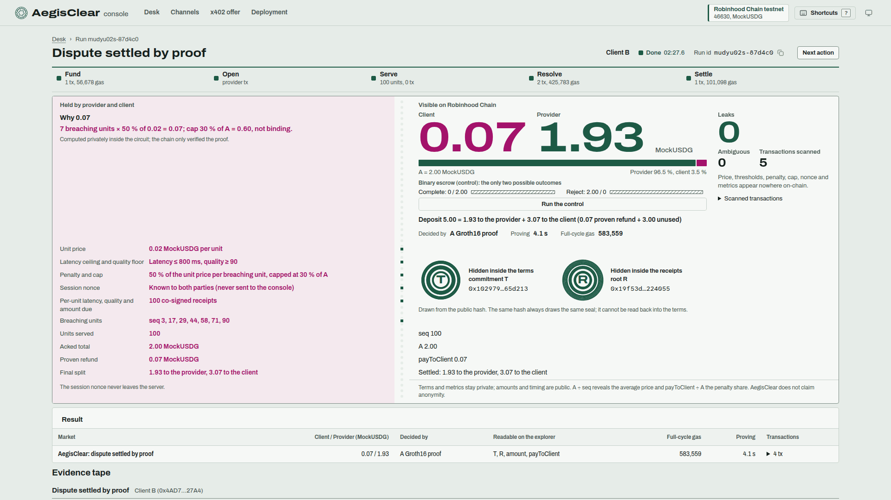

# AegisClear

AegisClear is privacy-preserving escrow and SLA dispute settlement for agent-to-agent payments over x402/MPP in USDG. The client pays into a micro-escrow state channel that sits at the x402 `payTo` address, and each unit of service produces a receipt that both agents sign off-chain. If the provider breaks the SLA, the refund is decided by a Groth16 zero-knowledge proof verified on-chain, and the deposit is split proportionally; the chain sees commitments, amounts and the final split, not the terms or the metrics. It runs on Robinhood Chain, an Arbitrum dedicated chain (Nitro): **testnet 46630 is live** (deploy v2, with `MockUSDG` as the token) and **mainnet 4663 is not deployed**.



*A real run on Robinhood Chain testnet 46630, 23 Sep 2026: a dispute settled by a Groth16 proof (0.07 MockUSDG back to the client, 1.93 to the provider), then the leak check: 0 leaks in 5 transactions.*

Full documentation, in Indonesian: [README.id.md](./README.id.md). Specification, in Indonesian: [prd-arsitektur.md](./prd-arsitektur.md).

## The problem, and the example in numbers

Agents on Robinhood Chain already pay each other in USDG over x402/MPP rails (MeshGateway, read 19 Sep 2026: 1,030 storefronts, 15,718 on-chain settlements, 512.48 USDG lifetime, an average of 0.033 USDG per settlement). The rails use x402 `exact`: pay first, receive later, no recourse. That is fine for cents, but for machine work worth tens to thousands of dollars the buyer carries all of the non-performance risk. ERC-8183 (Agentic Commerce, Feb 2026) adds per-job escrow, yet its evaluator is a single trusted party with a binary `complete`/`reject` outcome and public terms; its own text says the evaluator "MAY be a smart contract … verifying a zero-knowledge proof". AegisClear is that evaluator, and it is a circuit, not a human or an LLM.

Worked example EX1, executed on-chain: 100 requests at 0.02 USDG, and 7 of them breach the 800 ms latency SLA. The terms set a penalty of 50 % of the unit price per breaching unit, capped at 30 % of the acked amount.

| Rail | Result | Decided by |
|---|---|---|
| x402 `exact` | 2.00 USDG lost, no recourse | nobody: payment comes first |
| ERC-8183-style escrow | 0 or 2.00 back to the client (binary) | one trusted evaluator; the terms are public |
| **AegisClear** | **0.07 back to the client, 1.93 to the provider** | a Groth16 proof; the chain sees two commitments and the final split |

Why 0.07: 7 breaching units × 50 % of 0.02 = 0.07, and the cap (30 % of 2.00 = 0.60) does not bind. The unused 3.00 of the client's 5.00 deposit also returns to the client. Not new, and credited: escrow between agents (ERC-8183), usage-based payment (x402 `upto`, MPP `session`), state channels (Raiden, Perun). New: the evaluator is a circuit, the payout is proportional, the terms stay private, and the escrow lives at the x402 `payTo` ([prior art](./README.id.md#prior-art), Indonesian).

## How it works

1. **Offer.** The provider answers `GET /job` with a standard x402 `402 Payment Required` (`x402Version 1`, `scheme exact`, `network eip155:46630`). Its `payTo` is the CREATE2-predicted address of an `AegisChannel` clone (EIP-1167, `AegisChannelFactory.predict`), which can only become a channel with the exact terms the provider signed. AegisClear data rides in `extra.aegis`: the channel config, the provider's signature, the terms (for the client only), `unitQty` and `exitSig`, a seq-0 exit ticket that protects the client before the first unit.
2. **Fund and open.** The client funds that address in USDG (MockUSDG on testnet), and the provider opens the channel through the factory. `payoutClient` and `payoutProvider` are fixed at `open` and can be a fleet vault, a Safe or an ERC-4337 account instead of the agent's hot wallet.
3. **Serve, off-chain.** Each unit yields a receipt `(seq, qty, m1, m2, due)` and a cumulative checkpoint signed by both parties (EIP-712). There are zero transactions during service. Of the terms and the receipts, the chain only ever sees two commitments: `termsCommitment` T (a Poseidon hash of price, thresholds, penalty bps, cap bps and nonce) and `receiptsRoot` R (a Poseidon Merkle root over 128 slots).
4. **Close or dispute.** Normally both parties sign `closeCooperative`. In a dispute, the client calls `submitCheckpoint` with the highest co-signed checkpoint, then `claimPenalty` with a Groth16 proof that, under T and the receipts under R, the lawful penalty is `payToClient = min(Σ breach_i · ⌊due_i·π/10000⌋, ⌊A·κ/10000⌋)`. `SLASettlementVerifier` checks the proof on-chain (229,241 gas, measured in `Verifier.t.sol` with 6 public inputs), and the channel enforces `payToClient ≤ A` (`A` = the co-signed cumulative amount) whatever the verifier says.
5. **Challenge window, then settle.** During the challenge window (at least 60 s on the demo factory, 6 h on the production factory) the other party can answer with a higher co-signed checkpoint, which voids a pending proof. After it, anyone can call `settle()`. Without a valid proof, settlement pays exactly the last co-signed checkpoint.

Around that core:

- **Epoch rollover (FR-10).** An epoch holds at most 128 receipts (`MAX_SEQ`, set by the circuit size); the provider answers unit 129 with `409 epoch-full`. A co-signed `rollover()` pays out the old epoch and keeps the rest of the deposit as the next epoch's budget, so one deposit can cover many epochs.
- **Anchored mode (FR-25).** For high-value, low-frequency jobs, every unit is acked on-chain with `ack(seq, leaf, cumulativeAmount, sigProvider)`. The contract inserts the leaf hash, not the raw metrics, into a depth-7 incremental Poseidon Merkle tree: 7 hashes per `ack`, in one `insertPath` call to the Stylus program `AegisPoseidon`. A dispute starts with `startClose()` instead of a checkpoint.
- **Treasury router and payout hook (FR-26).** With `payoutProvider` set to `AegisTreasuryRouter`, the channel's payout hook forwards the payout, in the same transaction, to the treasury the agent registered with `setTreasury(treasury)`. A failed transfer (for example to a frozen address) becomes a credit claimable with `claim()`. Never send tokens directly to the router address.

There is no `owner`, `pause`, proxy or `upgradeTo` in the fund path, and a factory's parameters cannot change after deployment.

## Deployed on Robinhood Chain testnet (46630), deploy v2

Deployed 20 Sep 2026 from `contracts/script/DeployTestnet.s.sol` at block 122,028,843 (`0x746032b`), deployer `0x90351bB1E85a17D5f70c62C0cC076D39D897076D`. The seven Solidity contracts are verified on Blockscout (7/7); `AegisPoseidon` is the Stylus program, deployed with `cargo stylus deploy` and shared as-is by deploys v1 and v2. The v2 bytecode carries `HOOK_GAS` = 300,000 (v1 used 150,000) and the self-audit fixes: the `InsufficientGas` guard (M-1) and the zero-address checks in the factory constructor. `AEGIS_NETWORK=testnet` (SDK, demo CLI, console) reads these addresses from the committed [`contracts/deployments/testnet-46630.json`](./contracts/deployments/testnet-46630.json).

| Contract | JSON key | Role | Address (Blockscout) |
|---|---|---|---|
| `AegisChannelFactory` | `factory` | demo, co-signed mode, `MIN_CHALLENGE_WINDOW` 60 s | [`0x52773ab546e78828DDAbC4F3dA13eaCb167941B6`](https://explorer.testnet.chain.robinhood.com/address/0x52773ab546e78828DDAbC4F3dA13eaCb167941B6) |
| `AegisChannelFactory` | `factoryProd` | production, co-signed mode, `MIN_CHALLENGE_WINDOW` 21,600 s (6 h) | [`0xFB20a588750C700B9Bb5DD2e0278344bCd4e01E0`](https://explorer.testnet.chain.robinhood.com/address/0xFB20a588750C700B9Bb5DD2e0278344bCd4e01E0) |
| `AegisChannelFactory` | `factoryAnchored` | anchored mode (FR-25), `MIN_CHALLENGE_WINDOW` 60 s, `POSEIDON` = `AegisPoseidon` | [`0xa53eC39546f5Fb743A02dF412F290c2A435E2B76`](https://explorer.testnet.chain.robinhood.com/address/0xa53eC39546f5Fb743A02dF412F290c2A435E2B76) |
| `SLASettlementVerifier` | `verifier` | Groth16 verifier (snarkjs export) | [`0x2729cbdCd07719A40DC8d458ba7cDA5e40Afa405`](https://explorer.testnet.chain.robinhood.com/address/0x2729cbdCd07719A40DC8d458ba7cDA5e40Afa405) |
| `AegisTreasuryRouter` | `router` | payout router (FR-26) | [`0xE97dD3879B2aAe737b23B9219E5580EdB5Fae17A`](https://explorer.testnet.chain.robinhood.com/address/0xE97dD3879B2aAe737b23B9219E5580EdB5Fae17A) |
| `AegisPoseidon` | `poseidon` | Stylus program (Rust): circomlib Poseidon v1, 21.7 KB compressed | [`0x1027cf7DC26152012ed9Ef949Aa1432Bf1C7ef34`](https://explorer.testnet.chain.robinhood.com/address/0x1027cf7DC26152012ed9Ef949Aa1432Bf1C7ef34) |
| `MockUSDG` | `usdg` | test token: 6 decimals, permissionless `mint` | [`0x5A9BC1441DE45D7a722339Bec093637bc5042382`](https://explorer.testnet.chain.robinhood.com/address/0x5A9BC1441DE45D7a722339Bec093637bc5042382) |
| `SimpleJobEscrow` | `escrow` | Market A control: binary evaluator | [`0x6ddac1F8df3d0d0C9160B55DF781db1303b4b02E`](https://explorer.testnet.chain.robinhood.com/address/0x6ddac1F8df3d0d0C9160B55DF781db1303b4b02E) |

Used as-is, not redeployed (present on both 4663 and 46630): Permit2 `0x000000000022D473030F116dDEE9F6B43aC78BA3` and `x402ExactPermit2Proxy` `0x402085c248EeA27D92E8b30b2C58ed07f9E20001`. Real USDG on mainnet 4663 is `0x5fc5360D0400a0Fd4f2af552ADD042D716F1d168`; AegisClear is not deployed there. The earlier deploys v1 (before the self-audit fixes) and v0 (P0), and the transactions of the SDK integration run, are listed in [README.id.md](./README.id.md#alamat-kontrak).

## Try it

The operator console is [`aegisclear-console/`](./aegisclear-console/) (React 19, React Router v7, English labels). It is built into `web/dist` and served by the Hono server in `web/server` on port 4040, which holds the demo keys, the x402 provider and the Groth16 prover. There is no wallet in the browser, and the server listens on 127.0.0.1 only.

```bash
# Once: console dependencies (a standalone package outside the pnpm workspace), then build it into web/dist
pnpm -C aegisclear-console install --ignore-workspace
pnpm -C aegisclear-console build:web
# Testnet 46630 (needs RPC_URL, PK_PROVIDER, PK_CLIENT_A, PK_CLIENT_B, PK_DEPLOYER in .env, read automatically):
AEGIS_NETWORK=testnet pnpm --filter @aegisclear/web serve    # → http://localhost:4040
# Local (Anvil on 8545 with DeployLocal already run, zkey in circuits/build/):
pnpm --filter @aegisclear/web serve
# No chain at all: replays the recordings in docs/frontend/fixtures
VITE_API_MODE=fixtures pnpm -C aegisclear-console dev         # → http://127.0.0.1:4047
```

A live run (testnet or local) also needs the root `pnpm install`, the circuit artefacts (`pnpm --filter @aegisclear/circuits build`) and the proving key `sla_final.zkey` from the [release](#release-artefacts) in `circuits/build/`, because the server generates the proofs. In testnet mode, copy `.env.example` to `.env` and fund the four keys with Robinhood testnet ETH. The step-by-step setup (Anvil, `DeployLocal`, circuit artefacts, zkey download, test suites, testnet deploy) is in [README.id.md](./README.id.md#menjalankan-secara-lokal), in Indonesian. Note that `pnpm web` still builds the old UI (`web/src`) into `web/dist` and overwrites the console; run `pnpm -C aegisclear-console build:web` again to get it back.

Pages: **Desk** (the same job on three rails, from the latest run, plus the scenario launcher) · **run view** (a live tape over SSE: Fund → Open → Serve → Resolve → Settle, a 16 × 8 receipt grid, the proving time and the challenge-window countdown; it ends as the settlement slip, with the private terms beside the chain's view and a **Check for leaks** button) · **Channels** (every `ChannelOpened` across the three factories) · **channel record** (lifecycle, per-epoch settlement, privacy panel, event trail) · **x402 offer** (the annotated 402 JSON an x402 client sees) · **Deployment** (v2 addresses and known limitations).

Screenshots from the 23 Sep 2026 testnet run (1920 × 1080): [Desk](docs/media/console-testnet-2026-09-23/01-desk.png) · [x402 offer](docs/media/console-testnet-2026-09-23/02-x402-offer.png) · [live resolve: proof and challenge window](docs/media/console-testnet-2026-09-23/03-live-resolve-proof-and-window.png) · [channel record](docs/media/console-testnet-2026-09-23/05-channel-record.png) · [anchored verdict](docs/media/console-testnet-2026-09-23/06-anchored-verdict.png) · [rollover verdict](docs/media/console-testnet-2026-09-23/07-rollover-verdict.png).

## Verified

**In the browser, 23 Sep 2026** (new console, Chrome at 1920 × 1080, testnet v2): each run was clicked from the Desk through to the verdict and the leak check without a page reload; all requests were same-origin; axe reported 0 violations on every page, in both the light and dark themes.

| Scenario | Result (client / provider) | Full-cycle gas on 46630 | Proving | Click → verdict | Leak check | Channel |
|---|---|---|---|---|---|---|
| `B-dispute` | **0.07 / 1.93** | 584,859 | 3.5 s | 151 s | 0 leaks, 0 ambiguous, 5 tx | [`0x862Fea9D…3b5a`](https://explorer.testnet.chain.robinhood.com/address/0x862Fea9De214303D146DA79596EEe35e30273b5a) |
| `B-anchored-dispute` | **0.02 / 0.38** | 4,891,559 | 3.4 s | 140 s | 0 leaks, 0 ambiguous, 25 tx | [`0x14C5d55B…5a44`](https://explorer.testnet.chain.robinhood.com/address/0x14C5d55B081c5a7F2fD169f71F77b4d9112D5a44) |
| `B-rollover` | **0.00 / 2.66** | 304,002 | — | 116 s | 0 leaks, 0 ambiguous, 4 tx | [`0x4073eF03…Ef8f`](https://explorer.testnet.chain.robinhood.com/address/0x4073eF031b160a40927Af6593f902cA50969Ef8f) |

The first `B-dispute` run that day, the one in the screenshot at the top: 583,559 gas, proving 4.1 s, channel [`0x1365e210…41c8`](https://explorer.testnet.chain.robinhood.com/address/0x1365e210026F3f3c42A925bF32aA2C3DAe0841c8).

**Through the console API, 20 Sep 2026** (testnet v2, all six scenarios, 0 leaks and 0 ambiguous on every AegisClear channel). The result rows are identical to Anvil's because the penalty function is deterministic; only gas and waiting time differ. Durations include the real 60 s challenge window and about 2.5 s per confirmation block.

| Scenario | Result (client / provider) | Full-cycle gas | Proving | Duration | Channel |
|---|---|---|---|---|---|
| `B-dispute` (client B, 100 units, 7 breaches) | 0.07 / 1.93 | 575,544 | 4,165 ms | 158 s | [`0x4B6F3c6d…bBd1`](https://explorer.testnet.chain.robinhood.com/address/0x4B6F3c6d3b6BD02FEa8155a74AfaA04D0f03bBd1) |
| `B-anchored-dispute` (client A, 20 on-chain acks, Stylus) | 0.02 / 0.38 | 4,799,914 | 3,404 ms | 140 s | [`0xAD30BC16…879c`](https://explorer.testnet.chain.robinhood.com/address/0xAD30BC162CCd7cB7680760b4a6181186A28d879c) |
| `B-rollover` (client B, 128 + 5 units, 1 deposit) | 0.00 / 2.66 | 298,821 | — | 135 s | [`0xD1F69213…2b1D`](https://explorer.testnet.chain.robinhood.com/address/0xD1F69213799aDbc595ff8Eae6B8C20f917a22b1D) |
| `B-cooperative` (client A, 100 units) | 0.00 / 2.00 | 182,452 | — | 96 s | [`0x66C493f7…05dC`](https://explorer.testnet.chain.robinhood.com/address/0x66C493f712648419C11Ab8f21f8C6b0A21ff05dC) |
| `A-complete` (binary escrow, control) | 0 / 2.00 | 384,176 | — | 13 s | `SimpleJobEscrow` |
| `A-reject` (binary escrow, control) | 2.00 / 0 | 367,017 | — | 13 s | `SimpleJobEscrow` |

For the AegisClear rows, full-cycle gas leaves out the provider's `open` (308,476–312,398 gas); the per-transaction breakdown is in [README.id.md](./README.id.md#lihat-di-browser-web-console).

**Test suites:** forge 118 (including fuzz, invariant and FFI tests that generate real proofs), circuits 14, sdk 50, web 33, demo 5, stylus 9. The sdk integration suite against testnet v2 (20 Sep 2026): 15 pass and 4 skip automatically, because they use hardcoded Anvil accounts and only run on chain id 31337; the scenario channels listed in README.id.md all end `SETTLED`. The new console: 306 tests, plus `pnpm -C aegisclear-console qa`, 103 checks in real Chrome (fixture mode).

## Stylus: where, and the measured why

Stylus is used in one place only: the anchored-mode `insertPath`, 7 Poseidon hashes per `ack`, in `AegisPoseidon` ([`stylus/aegis-poseidon/`](./stylus/aegis-poseidon/), Rust `no_std`, a port of circomlib Poseidon v1). Its outputs are identical to the circuit, the SDK and the Yul twin (checked on both sides for `hash2(1,2)` and `insertPath`). Measured on testnet 46630 with `cast estimate` against the deployed contracts, total transaction gas ([`docs/benchmarks/poseidon.md`](./docs/benchmarks/poseidon.md) §5):

| Call | Yul (`PoseidonPathYul`) | Stylus (`AegisPoseidon`) | Result |
|---|---|---|---|
| `insertPath`: 7 hashes, the call `ack` makes | 252,271 | 144,076 | Stylus 1.75× cheaper (≈ 1.9× execution only) |
| `hash2`: 1 hash, not used on-chain | 62,138 | 82,593 | Yul cheaper |

A single hash is cheaper in Yul because this chain has no Stylus CacheManager, so every call pays the program init (≈ 8.8k gas); the contract therefore makes one `insertPath` call per `ack` instead of 7 separate hashes. Live on testnet v2, in the SDK integration run, the first `ack` cost 352,421 gas (cold storage) and the next ones 206,615–212,830.

The Groth16 verifier stays in Solidity on purpose: BN254 pairing is a precompile, and a Stylus verifier costs more (256,334 vs 194,396 gas in public benchmarks). We do not claim that Stylus makes ZK cheaper. An earlier benchmark used Poseidon2, which is not circuit-compatible; it was retracted and replaced by the numbers above. The Yul twins are deployed for the comparison: `PoseidonT3` [`0xd52e2919…`](https://explorer.testnet.chain.robinhood.com/address/0xd52e29197D7Fc27FB79240097B92a169408Ad3d1) and `PoseidonPathYul` [`0x804318aE…`](https://explorer.testnet.chain.robinhood.com/address/0x804318aE7b0cFCE9e1995A84B7833d95B2713766), which is also Plan B when no Stylus program is configured.

## What stays private, and what does not

What the chain sees in co-signed mode (spec §6.7):

| Visible on-chain | Hidden |
|---|---|
| Client, provider and payout addresses; the token | Unit price `p`, SLA thresholds `L*` and `Q*`, penalty `π`, cap `κ`, nonce `ν` |
| `B` (deposit), `A` (total acked), `seq` (number of units) | Per-unit `qty_i`, `m1_i`, `m2_i`, `due_i` |
| `payToClient` (if a penalty is claimed), the time of every transaction | How many units breached, and which kind of breach |
| `termsCommitment`, `receiptsRoot` | Their contents |

We do not claim anonymity. What can still be inferred: `A / seq` is the average price per receipt (not `p` if `qty` varies), `payToClient / A` is the penalty share (not the number of breaches, since `π` and `κ` are private), and the timing of acks shows the service rhythm. The SDK mitigates this with varying `qty` and several units per receipt. Anchored mode reveals more by design: per `ack`, the leaf hash and `cumulativeAmount`, so `A` per ack is public (with a constant `qty`, that implies the unit price); raw `qty`, `m1`, `m2`, `due` and the thresholds still never go on-chain.

The leak check (`pnpm --filter @aegisclear/demo leak-check`, or **Check for leaks** in the console) searches the calldata and logs of every transaction of a channel for the private values. Every AegisClear channel in the [verified runs](#verified) reports 0 leaks; for anchored channels the unit price is left out of the search, because `A` per ack already implies it.

## Honest limitations

- **Single-contributor trusted setup.** Phase 1 (Powers of Tau 2^17, generated locally because the public Hermez mirrors returned HTTP 403 on 19 Sep 2026) and phase 2 were both produced by one party, the author, with a fixed placeholder beacon. Whoever holds the toxic waste could forge proofs, but the loss is bounded on-chain: `payToClient ≤ A` holds whatever the verifier says (FR-18, tested in `contracts/test/Penalty.t.sol`), and only a channel party can claim. A public phase-1 and a phase-2 ceremony with at least 3 contributors are required before any non-demo mainnet funds. The artefacts can be verified (`snarkjs zkey verify`) but not reproduced bit for bit. Details: [README.id.md](./README.id.md#trusted-setup--regenerasi-zkey).
- **MockUSDG on testnet.** USDG does not exist on 46630, so the testnet token is `MockUSDG` (6 decimals, permissionless `mint`).
- **Mainnet 4663 is not deployed.** The deployer had 0 ETH on 20 Sep 2026.
- **Self-audit only.** Slither 0.11.5 plus manual review, not an independent audit ([`docs/audit/slither-2026-09.md`](./docs/audit/slither-2026-09.md)): 0 true-positive High/Medium, 2 Low fixed, and one manual Low (M-1, payout-hook gas stipend) fixed with regression tests.
- **Mesh facilitator path untested (V8).** Funding through a real x402 facilitator with `payTo` = the predicted channel has not been tested. The SDK client funds by a direct ERC-20 transfer; the Permit2 / `x402ExactPermit2Proxy` path is covered by Foundry tests (`Permit2.t.sol`). Plain x402 clients without the SDK must not be pointed at a channel `payTo`.
- **Reference SDK limitations**, none of which affects fund safety in the contracts: the `Aegis-Client` header is not authenticated (a one-unit grief), there is no per-session serialization, sessions are never evicted, and the provider opens a channel before checking that it is funded. Full list: [README.id.md](./README.id.md#keterbatasan-sdk-referensi-yang-diketahui).
- **Liveness assumptions.** Service needs both parties to cooperate: a client that stops acking costs the provider at most one unpaid unit (T2). The provider must run its in-process watcher to answer a stale checkpoint within the challenge window (T1).
- **Stylus program lifecycle.** `AegisPoseidon` expires after 365 days without calls; the automatic keepalive watcher is planned for P2, and until then keepalive is manual. If the program expires, anchored `ack` stops working, but funds stay recoverable through the pure-EVM `startClose`, `claimPenalty`, `settle` and `closeCooperative`.

## Repository map

| Path | Contents |
|---|---|
| [`contracts/`](./contracts/) | Solidity (Foundry): `AegisChannel`, `AegisChannelFactory`, `AegisTreasuryRouter`, `SLASettlementVerifier`, `PoseidonPathYul`, the `SimpleJobEscrow` control, `MockUSDG`; tests, deploy scripts, `deployments/` |
| [`circuits/`](./circuits/) | circom circuit `sla_settlement.circom` (Groth16), trusted-setup and proving scripts, tests |
| [`sdk/`](./sdk/) | TypeScript SDK: x402-style provider (Hono), agent client, prover, watcher |
| [`stylus/`](./stylus/) | `aegis-poseidon`, the Stylus Poseidon v1 program; `poseidon-bench`, the superseded Poseidon2 benchmark |
| [`web/`](./web/) | Console server (`web/server`: demo keys, x402 provider, Groth16 prover) and the old UI (`web/src`, fallback) |
| [`aegisclear-console/`](./aegisclear-console/) | The operator console, built into `web/dist` |
| [`demo/`](./demo/) | Demo harness, Market A (binary escrow) vs Market B (AegisClear), and the on-chain leak check |
| [`docs/`](./docs/) | Submission package, self-audit, benchmarks, toolchain log, console brief, screenshots |
| [`tools/`](./tools/) | `settlement_vectors.py`: Python reference settlement and test-vector generator |
| [`vectors/`](./vectors/) | Shared settlement vectors (EX1–EX3 and edge cases) for the Python reference, the SDK and the circuit |

## Documentation

- [README.id.md](./README.id.md): the full documentation, in Indonesian: local setup, testnet deploy, roles and access matrix, contract semantics, SDK limitations, trusted setup and zkey regeneration, prior art, liveness transactions, deploy history.
- [prd-arsitektur.md](./prd-arsitektur.md): the specification (PRD and architecture), in Indonesian.
- [docs/audit/](./docs/audit/): the Slither self-audit, with a verdict per finding and the raw output.
- [docs/benchmarks/poseidon.md](./docs/benchmarks/poseidon.md): the Stylus vs Yul Poseidon benchmark, in Indonesian.
- [docs/TOOLCHAIN.md](./docs/TOOLCHAIN.md): verified toolchain versions and per-task measurements.
- [docs/frontend/](./docs/frontend/): the console brief, API contract and recorded fixtures.
- [docs/SUBMISSION.md](./docs/SUBMISSION.md): the submission package (runbook, video script, judge Q&A); §4 is the English write-up.

## Release artefacts

The proving key `sla_final.zkey` (100,834,787 bytes) is not in git: it is too large, and it cannot be regenerated identically, because the setup draws entropy from `/dev/urandom` and a re-run produces a new zkey and verifier that do not match the committed ones. It ships as GitHub release [`v0.1.0-zkey`](https://github.com/mdlog/AegisClear/releases/tag/v0.1.0-zkey), created 20 Sep 2026 from commit `0e24687`, with six assets: `sla_final.zkey`, `verification_key.json`, `SLASettlementVerifier.sol`, `sla_settlement.r1cs` (61 MB), `pot17_final.ptau` (151 MB, the locally generated Powers of Tau 2^17) and `SHA256SUMS`.

```bash
gh release download v0.1.0-zkey --repo mdlog/AegisClear -D /tmp/aegis-rel && (cd /tmp/aegis-rel && sha256sum -c SHA256SUMS)
npx snarkjs zkey verify circuits/build/sla_settlement.r1cs /tmp/aegis-rel/pot17_final.ptau /tmp/aegis-rel/sla_final.zkey
```

| File | SHA-256 |
|---|---|
| `sla_final.zkey` | `dfb8395623080e403b8521efa8a26eb8886c7f277c87e303cdfb05d4728d1552` |
| `verification_key.json` | `9d915a7ecb7ed065d2b8330e00eac83bf98f51f83d1b6d9ac83f246f2ed8ec8e` |
| `SLASettlementVerifier.sol` | `03b5061a36f17cb3737d71c725562ec455bd3b002f2353a956361d325115eb1e` |
| `sla_settlement.r1cs` | `473f1e4cb2a9c89f65356e59d2a4d79fa9046bf0d0648908dd62079f6af4e1fb` |
